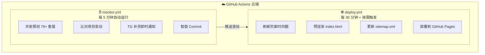

# 🚀 BandwagonHost (搬瓦工) VPS 全方案库存监控与 Telegram 补货推送系统

[](LICENSE)
[](https://tianqiongshaonian.github.io/)
[](https://www.python.org/)
[](#)

基于 **GitHub Pages**（前端展示）+ **GitHub Actions**（云端自动化 Python 探测）构建的 **100% 纯免费、零服务器、零维护** 的搬瓦工全方案库存实时监控与即时推送系统。

---

## ✨ 核心特性

- ⚡️ **零成本云端自动化**：由 GitHub Actions 每 5 分钟在云端自动运行 Python 探测，无需自备 VPS 服务器。
- 🏗️ **探测与部署解耦的双流水线架构**：
  - **探测流水线**（`monitor.yml`）：每 5 分钟高频探测库存，有变动即时推送 Telegram 通知。
  - **部署流水线**（`deploy.yml`）：每 30 分钟定时刷新页面 + 库存变动时立即触发部署，完美规避 GitHub Pages 10 次/小时的部署限额。
- 📱 **全设备自适应布局**：
  - **PC / 宽屏**：1600px 黄金视野，清晰表格展示，彻底消除横向滚动条。
  - **手机 / 平板**：自动切换为原生 App 级卡片流，2x2 核心参数网格，单手操作丝滑。
- 🔍 **超级详细智能搜索**：
  - 支持**空格分词多条件组合搜索**（如 `香港 1T`、`DC6 2G 有货`、`2核 40G`、`PID 44`）。
  - 支持智能地域与别名映射（`HK`、`日本`、`软银`、`美西`、`新加坡`、`The Plan`、`传家宝` 等）。
- 🔔 **Telegram 秒级补货推送 & 自动置顶**：
  - 探测到从"缺货"变为"有货"时，机器人自动向指定频道/群组推送精美卡片，并**自动置顶最新补货消息**。
- 🎨 **100% 纯本地化静态资源**：
  - 独立编译精简版 Tailwind CSS 与本地 Font Awesome 图标字体，**零外部 CDN 依赖**，控制台 0 警告，首屏极速秒开。
- 🚀 **极致 SEO 与 AI 抓取优化 (GEO / AI SEO Ready)**：
  - **双模渲染**：集成静态预渲染（Static Pre-rendering）+ 动态水合，爬虫与 AI（SearchGPT、Claude、Perplexity 等）无需执行 JS 即可秒抓全站 78+ 款方案、配置、实时库存与价格。
  - **结构化数据**：内嵌完整的 Schema.org (`WebSite`, `Product`, `ItemList`, `FAQPage`) JSON-LD，尊享 Google 富媒体搜索摘要与 AI 权威引用。
  - **全套搜索引擎与 AI 规范**：开箱即用 `robots.txt`、`sitemap.xml`、`llms.txt` 与 `llms-full.txt`，全面拥抱 AI 搜索时代。
- 🛡️ **智能提交与 14 天长效心跳保活**：
  - **零垃圾提交**：仅在真实发生补货/售罄变动时才触发 Git Commit，无变动时静默退出，Git 历史 100% 纯净。
  - **突破 60 天休眠限制**：通过 PAT（个人访问令牌）签发提交，每 14 天自动心跳保活，定时任务永久全自动运行。
- ⚙️ **极简配置架构**：
  - 所有的返利 ID、优惠码、Telegram 频道、消息模板均统一由 [`config.json`](data/config.json) 控制，改一处全站同步！

---

## 🏗️ 系统架构



---

## 📁 项目目录结构

```text
├── backend/                    # 🐍 Python 后端探测与推送系统
│   ├── __init__.py             #   Python 包初始化文件
│   ├── config.py               #   配置中心：统一解析 data/config.json 与环境变量
│   ├── checker.py              #   探测核心：多线程高并发库存探测与智能变动检测
│   ├── notifier.py             #   通知模块：负责 TG 模板渲染、消息发送与自动置顶
│   ├── sync_products.py        #   产品同步：全自动同步与新方案发现工具
│   └── test_tg.py              #   调试工具：命令行一键测试 Telegram 推送与置顶
├── frontend/                   # 🎨 前端源码（构建输入）
│   ├── templates/              #   🧩 HTML 模板片段（build.py 组装为完整 index.html）
│   │   ├── head.html           #     <head> 元标签 + Schema.org JSON-LD + <body> 开头
│   │   ├── header.html         #     顶部导航栏
│   │   ├── stat-cards.html     #     实时库存 / 探测时间 / 优惠码 三张统计卡
│   │   ├── filter-bar.html     #     分类 Tab + 搜索 / 排序 / 视图切换栏
│   │   ├── products.html       #     卡片流 + 表格容器
│   │   ├── no-results.html     #     无搜索结果提示
│   │   ├── guide.html          #     选购指南与核心机房线路解析
│   │   ├── faq.html            #     常见问题解答 (FAQ)
│   │   ├── noscript.html       #     <noscript> 降级提示
│   │   ├── footer.html         #     页脚
│   │   └── toast.html          #     Toast 提示 + <script> 引用
│   ├── js/
│   │   └── app.js              #   前端交互逻辑源码（构建时自动复制到 static/js/）
│   ├── css/
│   │   └── input.css           #   Tailwind CSS 源码（含自定义样式）
│   └── build.py                #   🔧 静态构建器：组装 index.html + 生成 data.js + 更新 sitemap
├── data/                       # 📊 数据与配置
│   ├── config.json             #   ⭐️ 全局配置（返利ID、优惠码、TG推送模板等）
│   └── products.json           #   核心数据源（78+ 款套餐配置与实时库存）
├── static/                     # 📦 部署用静态资源（直接上线，零外部 CDN）
│   ├── css/
│   │   └── tailwind.min.css    #   本地编译的高性能独立 Tailwind CSS
│   ├── js/
│   │   ├── app.js              #   构建时从 frontend/js/ 自动复制
│   │   └── data.js             #   构建时自动生成的运行时数据
│   ├── fontawesome/            #   本地 Font Awesome 6 图标与 WebFonts
│   └── images/                 #   站点图标资源
│       ├── favicon.svg
│       ├── favicon.ico
│       └── apple-touch-icon.png
├── index.html                  # 🌐 构建输出（自动生成，勿手动编辑）
├── sitemap.xml                 # XML 站点地图（自动更新时间戳）
├── robots.txt                  # 搜索引擎与 AI 爬虫抓取协议规范
├── llms.txt                    # 🤖 面向大模型与 AI Agent 的精炼摘要规范
├── llms-full.txt               # 📚 面向大模型的搬瓦工完整知识库文档
├── .github/workflows/
│   ├── monitor.yml             # 📡 库存探测工作流（每 5 分钟高频探测）
│   └── deploy.yml              # 🌐 Pages 智能部署工作流（每 30 分钟 + 按需）
├── tailwind.config.js          # Tailwind 构建配置
├── LICENSE
└── README.md                   # 项目使用与部署说明文档
```

---

## 🛠️ 新手 3 分钟一键部署教程

> 无论你是小白还是开发者，只需按照以下 3 步即可拥有专属的库存监控网站与 Telegram 推送机器人！

### 第一步：Fork 或新建 GitHub 仓库

1. 点击本仓库右上角的 **Fork** 按钮，将项目复制到你自己的 GitHub 账号下。
2. （或者）在 GitHub 新建一个仓库（如命名为 `你的用户名.github.io`），将本项目代码上传推送上去。

---

### 第二步：开启 GitHub Pages 网站服务

1. 进入你 Fork 后的 GitHub 仓库，点击顶部菜单的 **Settings（设置）**。
2. 在左侧侧边栏点击 **Pages**。
3. 在 **Build and deployment** 下方的 **Source** 下拉菜单中，选择 **`GitHub Actions`**。

> 💡 开启后，GitHub 将自动运行流水线，你的监控网站地址为：  
> **`https://<你的GitHub用户名>.github.io/<仓库名>/`**（若仓库名为 `<用户名>.github.io` 则为根域名直达）。

---

### 第三步：配置密钥与自定义设置

#### 1. 配置 Secrets 密钥（核心步骤）

打开 GitHub 仓库 → **Settings** → **Secrets and variables** → **Actions** → 点击 **New repository secret**，添加以下密钥：

| 密钥名称 | 是否必填 | 作用与获取方式 |
| :--- | :--- | :--- |
| `MY_PAT` | **强烈推荐** | **突破 60 天休眠**：在 GitHub → 头像 → Settings → Developer Settings → [Personal access tokens (Classic)](https://github.com/settings/tokens/new) 生成一个勾选 `repo` 与 `workflow` 权限的令牌，有效期选 **No expiration**。使定时任务永久保持活跃，免除 GitHub 60 天无活动自动暂停。 |
| `TG_BOT_TOKEN` | 可选 | **TG 补货推送**：Telegram 搜索 [@BotFather](https://t.me/BotFather)，发送 `/newbot` 获取机器人 Token（形如 `123456789:ABCdefGhIJK...`）。需将机器人拉入频道设为管理员，开启「发布消息」和「置顶消息」权限。 |
| `TG_CHAT_ID` | 可选 | **接收推送频道**：填入你的频道或群组用户名（如 `@bwg191`）。 |

#### 2. 修改你的专属返利 ID 与优惠码

直接在 GitHub 网页上编辑本仓库的 [`config.json`](data/config.json) 文件：

```json
{
  "site": {
    "title": "搬瓦工库存监控 - BandwagonHost VPS 实时库存与全网补货通知",
    "brand_name": "搬瓦工库存监控",
    "subtitle": "BandwagonHost Real-time Stock & Restock Monitor"
  },
  "affiliate": {
    "aff_id": "你的搬瓦工AFF返利ID",
    "promo_code": "BWHCXZAVFBVY",
    "discount_text": "6.78% 循环优惠",
    "discount_rate": 0.0678
  },
  "social": {
    "tg_channel": "https://t.me/你的频道用户名"
  }
}
```

---

## 🧪 本地调试与手动运行

项目完全基于 Python 原生标准库，**无需 `pip install` 任何第三方依赖**，克隆即跑！

### 1. 本地运行库存探测
```bash
python3 backend/checker.py
```

### 2. 本地生成静态页面
```bash
python3 frontend/build.py
```

### 3. 测试 Telegram 推送与自动置顶
```bash
python3 backend/test_tg.py "你的_TG_BOT_TOKEN" "@你的频道用户名"
```

### 4. 在 GitHub 网页上手动触发
1. 打开 GitHub 仓库的 **Actions** 标签页。
2. 在左侧列表点击对应的工作流名称：
   - **「库存探测与补货推送」**：手动执行一次库存探测。
   - **「智能部署 GitHub Pages」**：手动触发一次页面部署。
3. 点击右侧 **Run workflow** 按钮即可。

---

## 🌐 绑定独立自定义域名（可选）

如果你拥有自己的域名（例如 `stock.mydomain.com`）：
1. 在仓库的 **Settings** → **Pages** → **Custom domain** 中填入你的自定义域名并保存。
2. 在你的 DNS 解析服务商（如 Cloudflare / 腾讯云 / 阿里云）添加一条 `CNAME` 解析记录：
   - 主机记录：`stock`
   - 记录类型：`CNAME`
   - 记录值：`<你的GitHub用户名>.github.io`
3. 在 GitHub Pages 设置中勾选 **Enforce HTTPS**，免费开启 SSL 安全访问。

---

## 📄 开源许可证

本项目基于 [MIT License](LICENSE) 开源，欢迎 Fork、Star 和二次开发！
