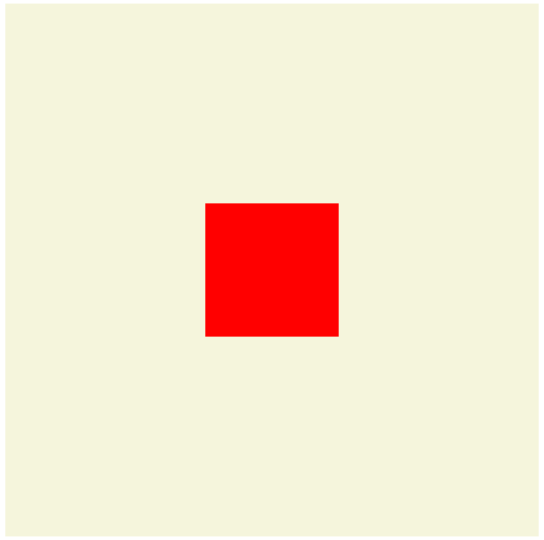

# css 元素垂直水平居中方法

**注意html代码是公共的**

**html 代码：**
	
	

       

	

**css代码：**

第一种居中方案:

	.box{
	    width: 600px;
	    height: 600px;
	    position: relative;
	    background: beige;
	}
	.inner_box{
	    width: 150px;
	    height: 150px;
	    background: red;
	    position: absolute;
	    top: 0;
	    left: 0;
	    right: 0;
	    bottom: 0;
	    margin: auto;
	}

第二种居中方案:

	.box{
	    width: 600px;
	    height: 600px;
	    position: relative;
	    background: beige;
	}
	.inner_box{
	    width: 150px;
	    height: 150px;
	    background: red;
	    position: absolute;
	    top: 50%;
	    left: 50%;
	    transform: translate(-50%,-50%);
	}

第三种居中方案:

	.box{
	    width: 600px;
	    height: 600px;
	    background: beige;
	    display: flex;
	    align-items: center;
	    justify-content: center;
	}
	.inner_box{
	    width: 150px;
	    height: 150px;
	    background: red;
	}

第四种居中方案:
	
	.box{
	    width: 600px;
	    height: 600px;
	    background: beige;
	    display: -webkit-box;
	    -webkit-box-align: center;
	    -webkit-box-pack: center ;
	}
	.inner_box{
	    width: 150px;
	    height: 150px;
	    background: red;
	}