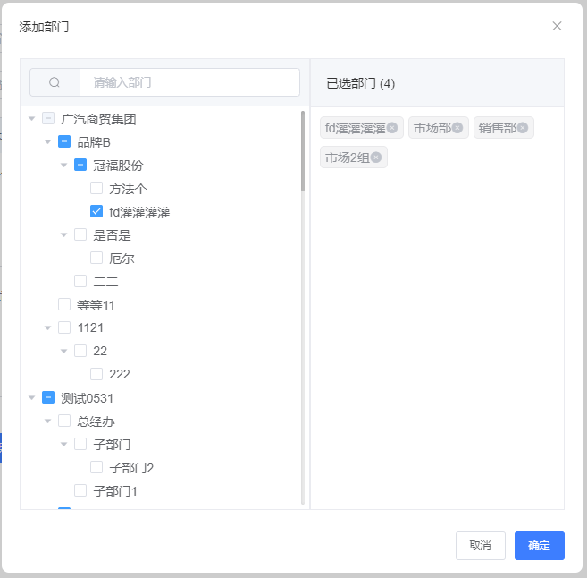

# el-tree生成唯一索引，通过索引值回溯到父级

el-tree 选择值必须是唯一索引

我们可以通过索子元素的索引还原父级的索引值，从而达到展开的效果

代码如下：
	
	<!DOCTYPE html>
	<html lang="en">
	<head>
	    <meta charset="UTF-8">
	    <meta http-equiv="X-UA-Compatible" content="IE=edge">
	    <meta name="viewport" content="width=device-width, initial-scale=1.0">
	    <title>Document</title>
	</head>
	<body>
	    
	</body>
	</html>
