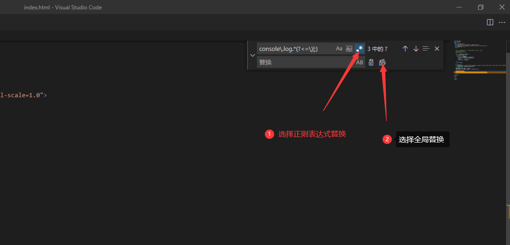

# js之json序列化【解决对象引用类型方法】

json序列化方案一：这里采用的是递归进行赋值的方法，目前我还没有发现有什么场景是不满足。

**场景一：**删除单个文件中的console.log

进入当前文件，按快捷键：ctrl+h 这个快捷建是查找替换**（注意要选择正则查找替换模式）**

**如果是删除，替换栏不用输入**

正则表达式代码如下：

	console\.log\(.*(\)|;)$

**场景二：**指定某个文件夹中的文件内容查找替换，vscode中快捷键是：**shift+alt+f** 原理都是一样的我这里就不一一详述了。
