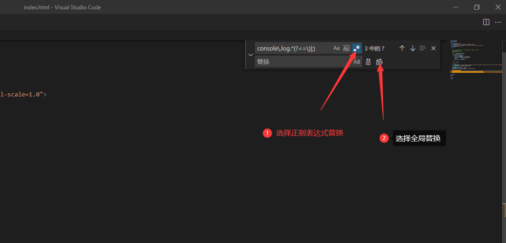

# vscode中批量删除console.log

在日常的前端开发中很多小伙伴是不是一直使用console.log()输出在控制台中，但是项目上线了，这些东西还能保留吗？所以今天我就叫大家一种方法批量删除console.log()

**场景一：**删除单个文件中的console.log

进入当前文件，按快捷键：ctrl+h 这个快捷建是查找替换**（注意要选择正则查找替换模式）**

**如果是删除，替换栏不用输入**

正则表达式代码如下：

	console\.log\(.*(\)|;)$

**场景二：**指定某个文件夹中的文件内容查找替换，vscode中快捷键是：**shift+alt+f** 原理都是一样的我这里就不一一详述了。
