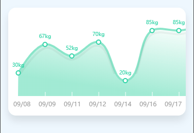

# 小程序绘制曲线图

**这里采用了原生 js 中的 canvas 组件绘制而成**

实际效果图：

wxml代码：

	<view class="efficacy">
	    <!-- 曲线 -->
	    <view class="chartsBox">
	        <view class="canvasBox">
	            <scroll-view class="temp_day_box" scroll-x>
	                <canvas canvas-id='curveCanvas' id='curveCanvas' class='curveCanvas'> </canvas>
	                <canvas canvas-id='lines' id='lines'  class='lines'> </canvas>
	            </scroll-view>
	        </view>
	    </view>
	</view>

wxss代码：

	.efficacy{
	  background: #eef7fe;
	  padding:30rpx;
	}
	/* 曲线 */
	.efficacyName {
	  color: #e2c162;
	  font-size: 26rpx;
	  font-weight: bold;
	  display: flex;
	  margin-bottom: 30rpx;
	  line-height: 30rpx;
	}
	
	.efficacyName>view {
	  width: 26rpx;
	  height: 26rpx;
	  margin-left: 10rpx;
	  border-radius: 4rpx;
	}
	.chartsBox{
	  position: relative;
	  width: 100%;
	  margin-bottom:40rpx;
	}
	.canvasBox{
	  width:690rpx;
	  height:420rpx;
	  position: relative;
	  background: #fff;
	  border-radius: 30rpx;
	  box-shadow: 0 10px 15px rgba(0,0,0,0.1);
	  overflow: auto;
	  overflow-y:hidden;
	  /* overflow-x:scroll; */
	}
	.curveCanvas{
	  /* width:100%; */
	  width:500px;
	  height:500rpx;
	  position: relative;
	  left: -10px;
	  top: -28px;
	}
	.xCoordinate{
	  position: absolute;
	  top: 0;
	  /* left:30rpx; */
	  display: flex;
	  /* width: 690rpx; */
	  height: 100%;
	  overflow: auto;
	}
	.xCoordinateTime{
	  padding-left:4rpx;
	  font-size:20rpx;
	  color: #fff;
	  /* color: red; */
	  width: 98rpx;
	  
	}
	.lines{
	  /* width:100%; */
	  width:500px;
	  position: absolute;
	  top: -21px;
	  left: -10px;
	}
	
	
	canvas{
	  width:none;
	  height: none;
	}
	.scoreTip{
	position: absolute;
	top:0;
	height:345rpx;
	}
	.scoreBg{
	  width:80rpx;
	  height:170rpx;
	  /* background: rgba(255, 255, 255, 0.8); */
	    display: flex;
	  flex-direction: column;
	  align-items: center;
	 justify-content: flex-end;
	  position: relative;
	}
	.score{
	  color: #d2b567;
	  font-size: 20rpx;
	  position: relative;
	  bottom: 10rpx;
	  top: 10rpx;
	}
	.scoreBox{
	  width: 12rpx;
	  height: 12rpx;
	  background:#fff;
	  border-radius: 50%;
	   position: relative;
	  bottom: 10rpx;
	  top: 10rpx;
	  border:5rpx solid  #8ae5c9;
	}

js代码由于多了一点我在这里就不贴出来了。

[**源码下载**](../file/curveCharts.rar)
