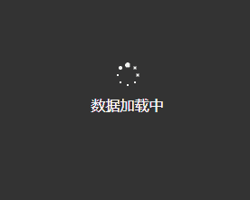

# 微信小程序自定义数据加载中

此处为测试接口 ，请自行更换成你的请求地址 和 参数。

效果示例图：

wxml 代码：

	<view class='Mask'>
	    <view class="loading" >
	      <view class="demo"></view>
	      <view class="demo"></view>
	      <view class="demo"></view>
	      <view class="demo"></view>
	      <view class="demo"></view>
	      <view class="demo"></view>
	      <view class="demo"></view>
	      <view class="demo"></view>
	    </view >
	    <view class="loadingTxt">数据加载中</view>
	</view>

wxss 代码：

	/* 加载中动画 start */
	.Mask {
	  width: 100%;
	  height: 100%;
	  position: fixed;
	  top: 0rpx;
	  z-index: 9999999;
	  background: rgba(0, 0, 0, 0.8);
	  display: flex;
	  flex-direction: column;
	  align-items: center;
	  justify-content: center;
	  
	}
	.loadingTxt{
	  color: #fff;
	}
	.loading {
	    margin-bottom: 20rpx;
	    position: relative;
	    width: 50rpx;
	    height: 50rpx;
	}
	.demo {
	    width: 4rpx;
	    height: 4rpx;
	    border-radius: 2rpx;
	    background: #fff;
	    position: absolute;
	    animation: demo linear 0.8s infinite;
	    -webkit-animation: demo linear 0.8s infinite;
	}
	.demo:nth-child(1){
	    left: 24rpx;
	    top: 2rpx;
	    animation-delay:0s;
	}
	.demo:nth-child(2){
	    left: 40rpx;
	    top: 8rpx;
	    animation-delay:0.1s;
	}
	.demo:nth-child(3){
	    left: 47rpx;
	    top: 24rpx;
	    animation-delay:0.1s;
	}
	.demo:nth-child(4){
	    left: 40rpx;
	    top: 40rpx;
	    animation-delay:0.2s;
	}
	.demo:nth-child(5){
	    left: 24rpx;
	    top: 47rpx;
	    animation-delay:0.4s;
	}
	.demo:nth-child(6){
	    left: 8rpx;
	    top: 40rpx;
	    animation-delay:0.5s;
	}
	.demo:nth-child(7){
	    left: 2rpx;
	    top: 24rpx;
	    animation-delay:0.6s;
	}
	.demo:nth-child(8){
	    left: 8rpx;
	    top: 8rpx;
	    animation-delay:0.7s;
	}
	
	@keyframes demo
	{
	    0%,40%,100% {transform: scale(1);}
	    20% {transform: scale(3);}
	}
	@-webkit-keyframes demo
	{
	    0%,40%,100% {transform: scale(1);}
	    20% {transform: scale(3);}
	}
	
	/* end */